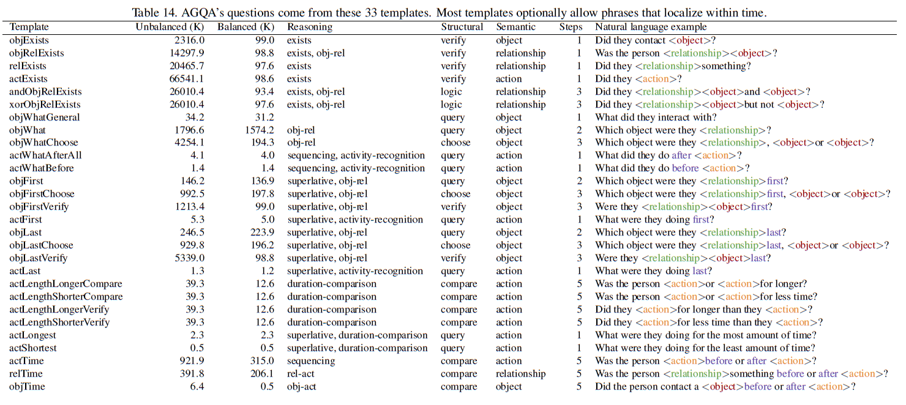

We handcraft 269 natural language question frames that can be answered from a set of 28 programs.

Our 28 templates generate AGQA’s question-answer pairs (Table 14).

Each template has multiple natural language
options that can be filled with scene graph information
to create a diverse set of questions (Figure 10).

The templates are also each associated with a program that
automatically generates the answer to questions using the
spatio-temporal scene graph. 
These programs are composed
of a discrete set of reasoning steps that can be combined in
numerous ways to answer a wide variety of questions (Table
11). 

Each question has several group labels describing
the question’s required reasoning skills (Table 10), semantic
class (Table 13), and structural category (Table 12).